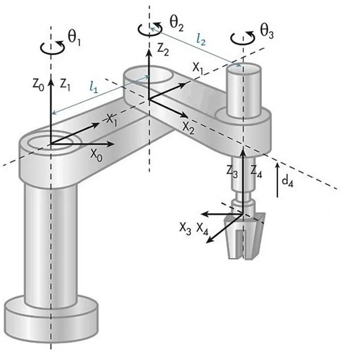

# Panda Gym. & Pybullet Resources

- [qgallouedec/panda-gym: Set of robotic environments based on PyBullet physics engine and gymnasium.](https://github.com/qgallouedec/panda-gym)
- [erwincoumans/pybullet_robots: Prototyping robots for PyBullet (F1/10 MIT Racecar, Sawyer, Baxter and Dobot arm, Boston Dynamics Atlas and Botlab environment)](https://github.com/erwincoumans/pybullet_robots)
- [Scara Robot Modeling and Simulation with PyBullet | by Reflect Robotics | Medium](https://medium.com/@reflectrobotics/scara-robot-modeling-and-simulation-with-pybullet-7bb204958763)

```python
from panda_gym.envs.core import PyBulletRobot
from panda_gym.pybullet import PyBullet
```

PyBullet is an Application Programming Interface (API) that allows you to have quick access to robot simulation using the [Bullet Physics SDK](https://github.com/bulletphysics/bullet3) simulation engine. Just with a robot model, you're ready to start programming your robot right away without the need for a laborious simulation setup as you would do in Robot Operating System (ROS). It is a quick tool for research and training.

In this article, you will learn how to create a **SCARA (Selective Compliance Articulated Robot Arm)** model and simulate it with PyBullet using the python programming language.



Robot models can be designed using CAD (Computer Aided Design) software like Fusion360, SolidWorks, Blender, and FreeCAD or programmed with tools like OpenSCAD. Robot simulation software like [ROS2](https://reflectrobotics.com/course/ros-2-for-beginners) or PyBullet needs to read robot files in certain file formats and one of these formats is called URDF (Unified Robot Description Format) which defines the physical properties of a robot. CAD software can convert robot models to URDF but because our SCARA robot is a simple model we will write the URDF code ourselves to have a better understanding of how it works.

Our scara robot will be a 2R (2 Revolute joints) robot with 2-DOF (degrees-of-freedom) and no gripper (or end-effector).

_To start learning about Robot Operating System (ROS2) for robot control, check out our_ [_comprehensive course for beginners_](https://reflectrobotics.com/course/ros-2-for-beginners)_._

## Creating our SCARA robot

- [URDF Viewer Example](https://gkjohnson.github.io/urdf-loaders/javascript/example/bundle/index.html)
